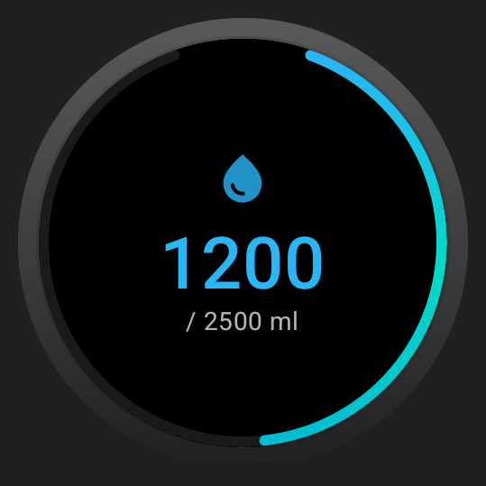
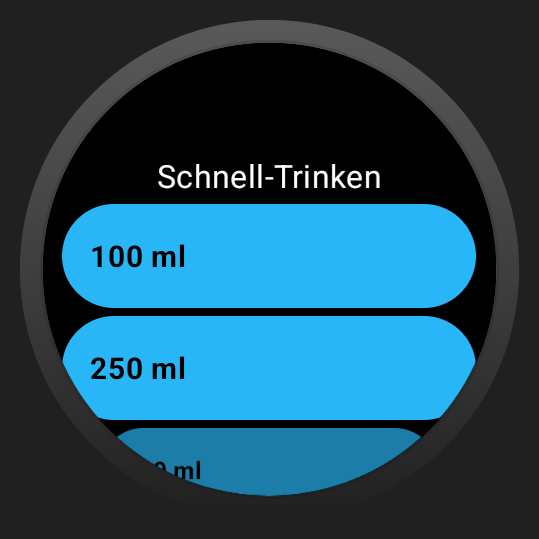
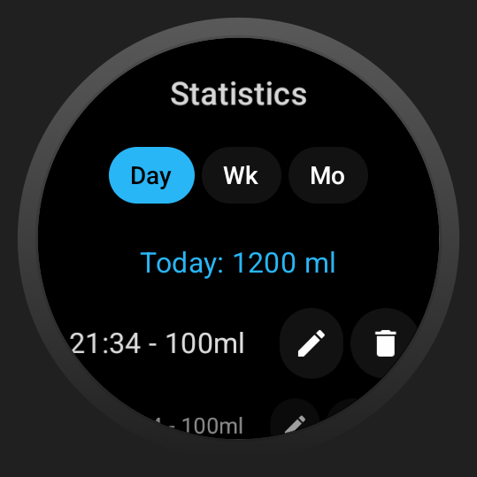
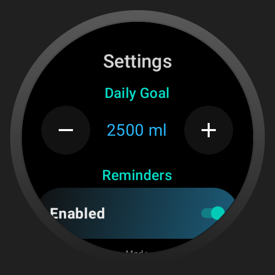

# Simple Sip Scheduler

A modern, elegant, and intuitive water tracker for Wear OS that helps you stay hydrated throughout the day. With a minimalist design and powerful features, this app makes it easy to track your drinks and reach your goals.

## Table of Contents

- [Overview](#overview)
- [App Gallery](#app-gallery)
- [Features](#features)
- [Installation & Development](#installation--development)
  - [Prerequisites](#prerequisites)
  - [Build via Wi-Fi Debugging](#build-via-wi-fi-debugging)

---

## App Gallery

Here is an overview of the main screens of the app:

| **Home Screen** | **Quick Add** | **Statistics** | **Settings** |
| :---: | :---: | :---: | :---: |
|  |  |  |  |
| *Current progress at a glance* | *Quickly add drinks* | *Your hydration history in detail* | *Personalization and goals* |

> **Note:** The app also offers a Tile for quick access directly from the watch face!

---

## Features

*   **Daily Goal:** Set your individual daily goal and track your progress in real-time.
*   **Quick Add:** Add drinks with just a few clicks without navigating through long menus.
*   **Detailed Statistics:** Analyze your drinking habits over days and months.
*   **Wear OS Tile:** A widget (Tile) allows adding water directly from the watch home screen.
*   **Smart Reminders:** (Optional) Stay on track with gentle reminders.
*   **Elegant Dark Mode Design:** Perfectly optimized for the battery life of OLED displays on smartwatches.

---

## Installation & Development

This guide helps you set up the project in Android Studio and install it on your Wear OS watch.

### Prerequisites

1.  **Android Studio:** Download and install the latest version of [Android Studio](https://developer.android.com/studio).
2.  **Wear OS Device:** A smartwatch with Wear OS or an emulator.

### Build via Wi-Fi Debugging

To install and debug the app wirelessly on your smartwatch, follow these steps:

1.  **Enable Developer Options (on the watch):**
    *   Go to *Settings > System > About > Versions*.
    *   Tap the **Build number** 7 times until the message "You are now a developer" appears.

2.  **Enable Wi-Fi Debugging:**
    *   Go back to *Settings > Developer options*.
    *   Enable **ADB debugging**.
    *   Scroll down and enable **Wireless debugging** (ensure watch and PC are on the same Wi-Fi).

3.  **Connect with Android Studio:**
    *   Open Android Studio.
    *   Click on **Pair Devices Using Wi-Fi** in the device dropdown menu (top toolbar).
    *   On the watch, under *Developer options > Wireless debugging*, select **Pair new device**.
    *   Enter the pairing code in Android Studio.

4.  **Start App:**
    *   Select your watch as the target device in Android Studio.
    *   Click the green **Run** button to build and install the app.

---

  Developed for Wear OS

